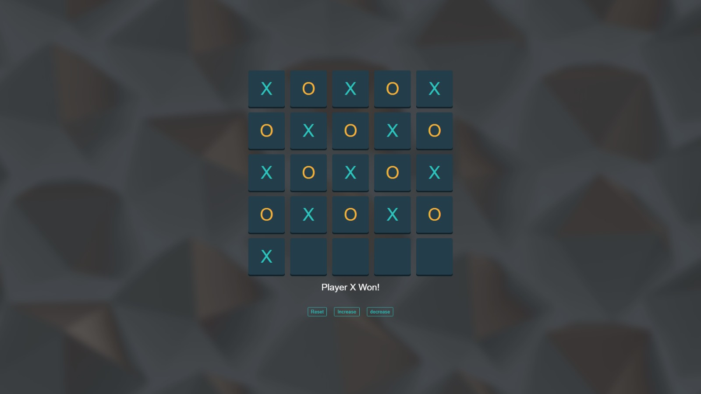

# 🎮 Tic Tac Toe Game

A modern and interactive Tic Tac Toe game built using HTML, CSS, and JavaScript. This project provides a clean user interface, smooth gameplay experience, and responsive design that works across different devices.

📌 Overview

This project is a browser-based implementation of the classic Tic Tac Toe game where two players compete to place three matching symbols in a row, column, or diagonal.

The game was developed to practice and demonstrate core front-end web development skills including:

HTML structure and semantic design
CSS styling and responsive layouts
JavaScript game logic and DOM manipulation
✨ Features
🎯 Two-player gameplay
🖥️ Responsive and modern UI
⚡ Real-time game updates
🔄 Restart / Reset functionality
🏆 Win and draw detection
🎨 Clean animations and styling
📱 Mobile-friendly design
🛠️ Technologies Used
HTML5 — Structure of the game
CSS3 — Styling and layout
JavaScript (ES6) — Game functionality and logic.

🎮 How to Play
 1- Player X starts the game.
 2-Players take turns selecting empty cells.
 3-The first player to align 3 symbols horizontally, vertically, or diagonally wins.
 4-If all cells are filled without a winner, the game ends in a draw.

 📸 Preview

 

 👨‍💻 Author

Developed by Adham Hesham

GitHub: [**https://github.com/your-username**](https://github.com/adhamhesham19)
